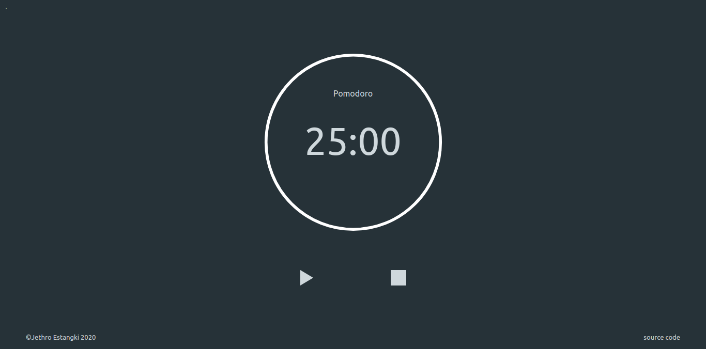

# Pomodoro Clock
A web version of a Pomodoro clock. 
From [The Odin Project's](https://www.theodinproject.com/) [curriculum](https://www.theodinproject.com/courses/web-development-101/lessons/pairing-project) 
This was supposed to be a pair project but I didn't have anyone to pair with, so I made it on my own.

## To-do
* Add ticking sound every second
